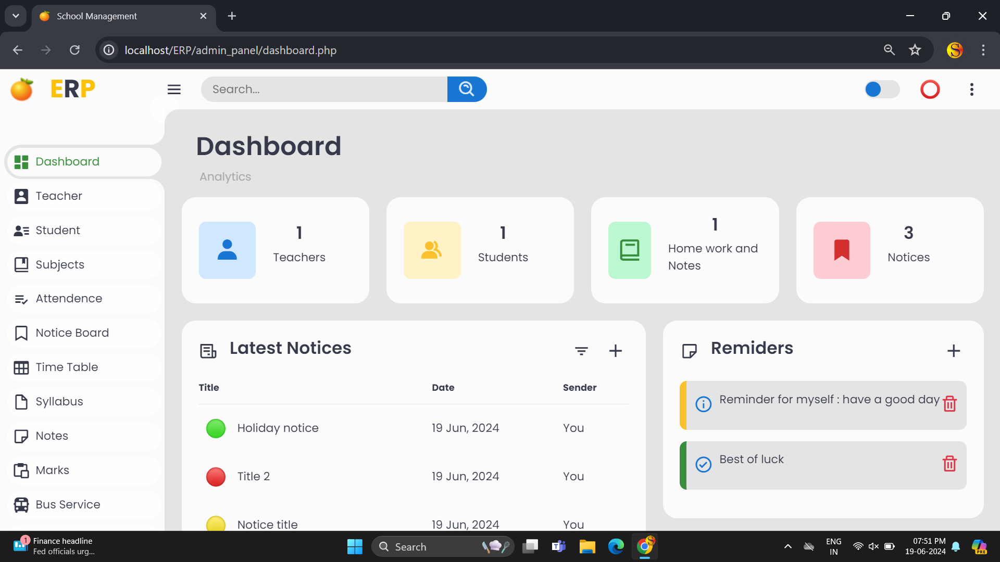
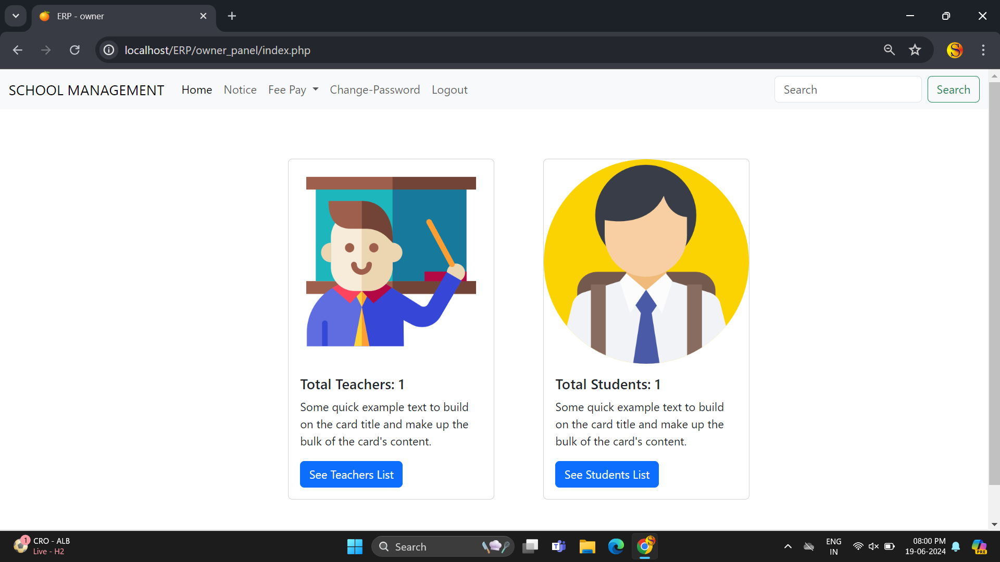
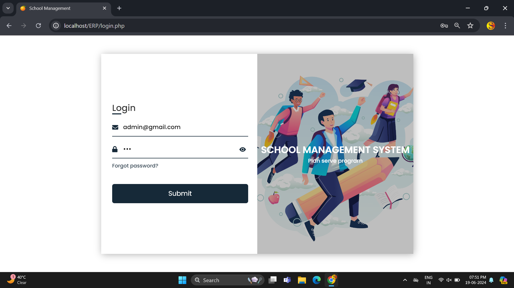
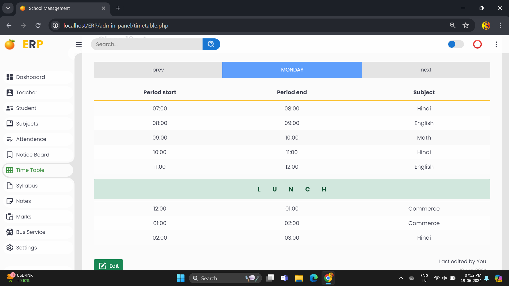
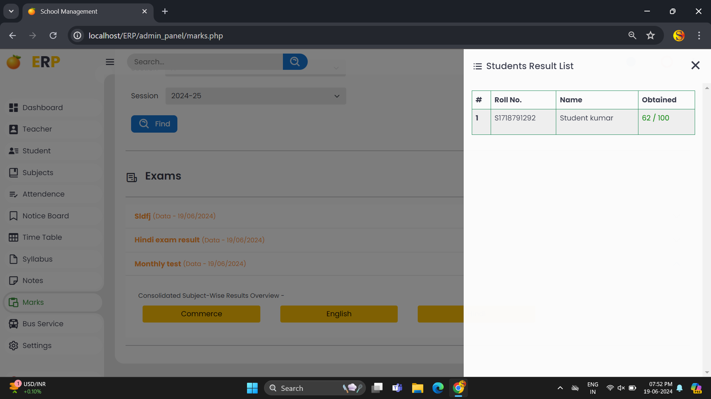
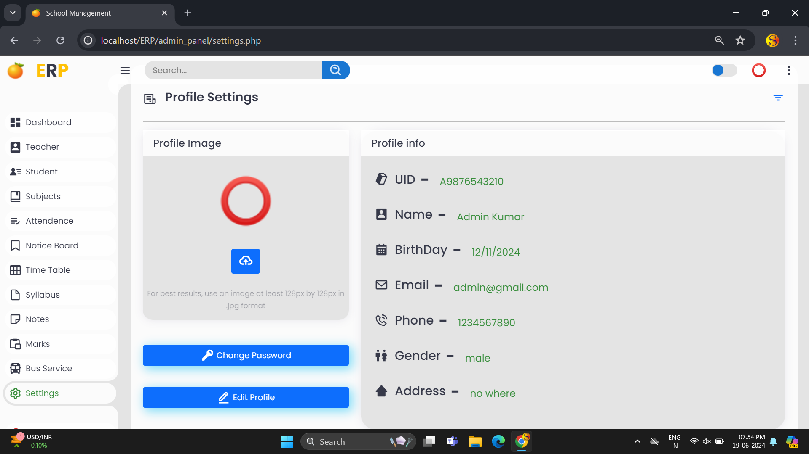

# 🎓 Go School - Enterprise School Management System (ERP)

<p align="center">
  
</p>

<p align="center">
  
  
  
  
  
</p>

---

## 📌 Table of Contents
- [Overview](#-overview)
- [System Architecture & Portals](#-system-architecture--portals)
  - [1. Administrator Portal](#1-administrator-portal)
  - [2. Teacher Portal](#2-teacher-portal)
  - [3. Student Portal](#3-student-portal)
  - [4. School Owner Portal](#4-school-owner-portal)
  - [5. Authentication & Recovery](#5-authentication--security)
- [Visual Showcase & Screenshots](#-visual-showcase--screenshots)
- [Database Schema & Architecture](#-database-schema--architecture)
- [Prerequisites & Requirements](#-prerequisites--requirements)
- [Installation & Setup Guide](#-installation--setup-guide)
- [Default Demo Credentials](#-default-demo-credentials)
- [Project Directory Structure](#-project-directory-structure)
- [Security & Environment Isolation](#-security--environment-isolation)
- [Contributing & License](#-contributing--license)

---

## 📖 Overview

**Go School** is a full-featured web-based School Management ERP application engineered to centralize and automate school administrative workflows, classroom operations, student data, and transport infrastructure. 

Built using a procedural PHP backend with prepared statements, a relational MySQL database, and a responsive frontend powered by Bootstrap 5 and modern CSS, Go School provides tailored, role-segregated portals for all primary stakeholders in an academic institution.

---

## 🏛️ System Architecture & Portals

```
                         ┌─────────────────────────────┐
                         │   Go School Unified Login   │
                         │   (login.php / assets/auth) │
                         └──────────────┬──────────────┘
                                        │
           ┌────────────────────────────┼───────────────────────────┐
           │                            │                           │
           ▼                            ▼                           ▼
┌────────────────────┐       ┌────────────────────┐      ┌────────────────────┐
│  Admin Portal      │       │  Teacher Portal    │      │  Student Portal    │
│  - User Management │       │  - Attendance Reg. │      │  - Academics & Bio │
│  - Fleet & Routes  │       │  - Exam Scoring    │      │  - Attendance Pie  │
│  - Timetable Master│       │  - Notes & Syllabi │      │  - Bus Details     │
│  - Global Notices  │       │  - Leave Requests  │      │  - Progress Cards  │
└────────────────────┘       └────────────────────┘      └────────────────────┘
           │
           ▼
┌────────────────────┐
│  Owner Portal      │
│  - Total Metrics   │
│  - Payroll Tracking│
└────────────────────┘
```

---

### 1. Administrator Portal (`admin_panel/`)
The Administrator Portal acts as the master control center for institutional management:

* **Student & Teacher Directories**: Complete record creation, document attachments, guardian details, and identity editing.
* **Academic Master**: Class and section definitions, subject mappings, syllabus distribution, and interactive timetable builder.
* **Bus Transport & Fleet Management**: Add buses, define bus drivers/helpers, build step-by-step route stops with arrival time milestones, and process student transport service requests.
* **Examination & Marks Processing**: Publish examination titles, record student marks, filter results by class and section, and consolidate report cards.
* **Notices & Sticky Reminders**: Institutional broadcast noticeboard with color tags and personalized dashboard task reminders.
* **Light / Dark Themes**: Persistent user interface personalization stored per account in the database.

<p align="center">
  
  
</p>

---

### 2. Teacher Portal (`teacher_panel/`)
Equips educators with classroom and curriculum tools:

* **Daily Attendance Register**: Filter by class/section, mark present/absent states, and record historical timestamps.
* **Curriculum Management**: Upload and update subject-specific syllabi and downloadable class study notes for students.
* **Examination Scoring**: Input student scores against scheduled exams with instant result previewing.
* **Leave Requests**: Submit formal leave applications with date spans and reason categories; track real-time administrative approval status.

<p align="center">
  
  
</p>

---

### 3. Student Portal (`student_panel/`)
A responsive learner workspace tailored for desktop and mobile devices:

* **Academic Dashboard**: High-level profile info, guardian contact details, and attendance percentage visualizer (Google Charts pie-chart).
* **Timetable Viewer**: Daily schedule breakdown showing period start/end times, assigned subjects, and lunch breaks.
* **Examination Progress**: Consolidated report cards displaying obtained scores, maximum marks, pass/fail status, and date histories.
* **Transport Tracker**: Review assigned bus number, route stops, driver contacts, and request bus services.
* **Fee Overview**: Installment fee calculation and receipt overview.

<p align="center">
  
  
</p>

---

### 4. School Owner Portal (`owner_panel/`)
Provides executive management with high-level institutional health metrics:

* **Institutional Counts**: Real-time aggregation of total registered teachers and enrolled students.
* **Directory Review**: Quick lookup of staff and student registers.
* **Payroll Overview**: Disbursement stubs and teacher payment records.

<p align="center">
  
</p>

---

### 5. Authentication & Security
* **Unified Single Login (`login.php`)**: Role-aware router validating user credentials via `password_verify` and directing accounts directly to their assigned portal.
* **Self-Service Password Recovery (`forgotPassword.php`)**: Email-based OTP verification using PHPMailer with standard SMTP handshake.
* **Access Control**: Session-based role guards (`noSessionRedirect.php` and `verifyRoleRedirect.php`) protect restricted views.

<p align="center">
  
</p>

---

## 📸 Visual Showcase & Screenshots

| Feature | Preview | Feature | Preview |
| :--- | :---: | :--- | :---: |
| **Noticeboard Management** |  | **Master Timetable Generator** |  |
| **Marks & Results Entry** |  | **Bus Fleet & Route Stops** |  |
| **Route Node Manager** |  | **Profile & Credentials Settings** |  |
| **Student Progress Card** |  | **Account Password Reset** |  |

---

## 🗄️ Database Schema & Architecture

The database schema (`_sms`) is normalized into 24 specialized tables:

| Table | Purpose |
| :--- | :--- |
| `users` | Central authentication table storing `email`, `password_hash`, `role`, and UI `theme`. |
| `admins` | Administrative personnel personal records, address, contact, and profile avatar. |
| `teachers` | Teacher staff directory, subject specialization, DOB, contact, and class mappings. |
| `students` | Student academic register, enrollment details, class, section, and picture path. |
| `student_guardian` | Guardian contact details, emergency telephone, address, and relation to student. |
| `attendence` | Daily student attendance records tagged with `student_id`, `class`, `section`, and date. |
| `buses` | Fleet tracking table storing bus identifiers, numbers, titles, and request flags. |
| `bus_root` | Detailed route stops for each bus with arrival timestamps and sequence order. |
| `bus_staff` | Bus driver and helper personnel records associated with each vehicle. |
| `classes` | Class definitions and active academic grades. |
| `subjects` | Course offerings mapped to academic classes. |
| `syllabus` | Uploaded curriculum file references categorized by class and subject. |
| `notes` | Teacher-authored study guides, notes files, and supplementary comments. |
| `exams` | Scheduled examination sessions, dates, and subject titles. |
| `marks` | Recorded examination scores, obtained marks, and grade summaries. |
| `leaves` | Teacher leave applications, categories (Casual, Medical), date spans, and status. |
| `notice` | Broadcast institutional notices, descriptions, file attachments, and date tags. |
| `reminders` | Dashboard operational reminders and user to-do items. |
| `time_table` | Weekly recurring period schedules with start/end time milestones and subjects. |
| `fee_record` | Student fee installment tracking and payment receipts. |
| `payroll` | Staff salary disbursements and payroll records. |
| `feedback` | Teacher-to-student and administrative feedback entries. |

---

## 💻 Prerequisites & Requirements

- **PHP**: `8.0` or higher (compatible with PHP 8.2)
- **Database**: MySQL `5.7+` or MariaDB `10.4+`
- **Web Server**: Apache (`mod_rewrite` enabled)
- **PHP Extensions**: `mysqli`, `curl`, `openssl`, `mbstring`, `fileinfo`
- **Local Development Suites**: [XAMPP](https://www.apachefriends.org/), [WAMP](https://www.wampserver.com/), or [Laragon](https://laragon.org/)

---

## ⚙️ Installation & Setup Guide

### 1. Clone the Repository
Clone the codebase into your local web server's public root (`htdocs` for XAMPP, `www` for WAMP):
```bash
cd C:/xampp/htdocs
git clone https://github.com/Amar1604/go-school.git
```

### 2. Import the Database Schema
1. Launch **Apache** and **MySQL** via your server control panel.
2. Open **phpMyAdmin** in your browser (`http://localhost/phpmyadmin`).
3. Click **New** and create a database named:
   ```sql
   _sms
   ```
4. Select the `_sms` database, navigate to the **Import** tab, choose the file:
   ```
   database/_sms.sql
   ```
5. Click **Import** (or run `mysql -u root _sms < database/_sms.sql` via command line).

### 3. Configure Database Credentials
Examine `assets/config.php` (a template is provided in `assets/config.example.php`):
```php
<?php
$server = "localhost";
$user = "root";
$password = "";    // Set your MySQL password if configured
$db = "_sms";

$conn = mysqli_connect($server, $user, $password, $db);

if (!$conn) {
    header('Location: ../errors/error.html');
    exit();
}
?>
```

### 4. Configure SMTP Email Settings (Optional / For Password Reset)
Copy the template file to create your local private mail configuration:
```bash
cp assets/mail_config.example.php assets/mail_config.php
```
Open `assets/mail_config.php` and provide your SMTP details:
```php
<?php
define('SMTP_HOST', 'smtp.gmail.com');
define('SMTP_PORT', 587);
define('SMTP_USER', 'your_email@gmail.com');
define('SMTP_PASS', 'your_gmail_app_password');
define('SMTP_SECURE', 'tls');
define('SMTP_FROM_EMAIL', 'your_email@gmail.com');
define('SMTP_FROM_NAME', 'Go School ERP');
?>
```
*(Note: `assets/mail_config.php` is strictly ignored by `.gitignore` to prevent leaking your credentials).*

### 5. Access the Application
Open your web browser and navigate to:
```
http://localhost/go-school/
```

---

## 🔑 Default Demo Credentials

The pre-seeded database contains four ready-to-test accounts for every portal:

| Role | Portal URL | Email | Password |
| :--- | :--- | :--- | :--- |
| 🛠️ **Admin** | `admin_panel/dashboard.php` | `admin@gmail.com` | `admin@gmail.com` |
| 🧑‍🏫 **Teacher** | `teacher_panel/dashboard.php` | `teacher@gmail.com` | `teacher@gmail.com` |
| 🎒 **Student** | `student_panel/index.php` | `student@gmail.com` | `student@gmail.com` |
| 👑 **Owner** | `owner_panel/index.php` | `owner@gmail.com` | `owner@gmail.com` |

> *Tip: Passwords can also be changed from the respective Settings panel once logged in.*

---

## 📂 Project Directory Structure

```
go-school/
│
├── .gitignore                    # Ruleset excluding runtime uploads & secret files
├── README.md                     # Comprehensive project documentation
├── index.php                     # Public landing presentation page
├── login.php                     # Unified authentication portal
├── login-backend.php             # Session initiation & role routing engine
├── forgotPassword.php            # OTP password recovery controller
├── styles.css                    # Public landing page styling
│
├── assets/                       # Central API endpoints & server scripts
│   ├── config.php                # Database connection handler
│   ├── config.example.php        # Database template
│   ├── mail_config.example.php   # SMTP configuration template
│   ├── noSessionRedirect.php     # Session authentication middleware
│   ├── addStudent.php            # Student creation endpoint
│   ├── fetchStudents.php         # Student search & AJAX loader
│   ├── removeStudent.php         # Student record deletion
│   ├── uploadMarks.php           # Examination marks ingestion
│   ├── uploadNotes.php           # Notes file storage handler
│   └── uploadSllyabus.php        # Syllabus file storage handler
│
├── database/
│   └── _sms.sql                  # Complete MySQL schema & seed data dump
│
├── admin_panel/                  # Administrator portal
│   ├── dashboard.php             # Analytics metrics & quick notices
│   ├── student.php               # Student directory management
│   ├── teacher.php               # Teacher directory management
│   ├── buses.php                 # Fleet and route stops master
│   ├── marks.php                 # Examination results & grading
│   ├── timetable.php             # Schedule configuration
│   ├── noticeboard.php           # Broadcast notice publisher
│   └── settings.php              # Admin profile & theme switcher
│
├── teacher_panel/                # Teacher portal
│   ├── dashboard.php             # Teacher workspace & notices
│   ├── attendence.php            # Classroom attendance register
│   ├── leaves.php                # Leave applications & status
│   ├── marks.php                 # Subject-level exam entry
│   ├── notes.php                 # Study guide uploads
│   └── syllabus.php              # Curriculum viewer
│
├── student_panel/                # Student portal
│   ├── index.php                 # Profile & attendance pie chart
│   ├── timetable.php             # Weekly academic timetable
│   ├── exam.php                  # Examination scores & report card
│   ├── buspanel.php              # Transport details & service requests
│   └── fee-payment.php           # Fee schedule breakdown
│
├── owner_panel/                  # School owner portal
│   ├── index.php                 # Staff & student enrollment counters
│   ├── make-payment.php          # Payroll disbursement form
│   └── see-payment.php           # Payment receipts overview
│
├── phpmailer/                    # PHPMailer SMTP email engine
├── screenshots/                  # High-resolution application screenshots
└── *Uploads/                     # File upload storage (admin, student, teacher, notes, etc.)
```

---

## 🔒 Security & Environment Isolation

This repository follows standard security practices for public open-source distribution:
1. **Zero Secret Leaks**: No plain-text API keys, passwords, or live mail server tokens are committed to source control.
2. **Ignored Uploads**: User avatar uploads and study material caches in `*Uploads/` directories are excluded via `.gitignore`, while folder structures are preserved with `.gitkeep`.
3. **Prepared Statements**: Core database operations use parameterized MySQLi queries to mitigate SQL injection.

---

## 🤝 Contributing

Contributions, feature suggestions, and bug reports are welcome!
1. Fork the Project (`https://github.com/Amar1604/go-school/fork`)
2. Create your Feature Branch (`git checkout -b feature/NewFeature`)
3. Commit your Changes (`git commit -m 'feat: Add NewFeature'`)
4. Push to the Branch (`git push origin feature/NewFeature`)
5. Open a Pull Request

---

## 📜 License
Distributed under the MIT License. See `LICENSE` for details.

Developed with 💗 by Amol Gupta, Amrita Singh, Amardeep, and Aditya Yadav.
